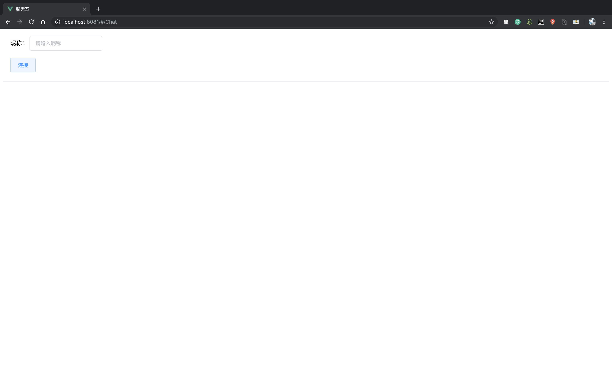
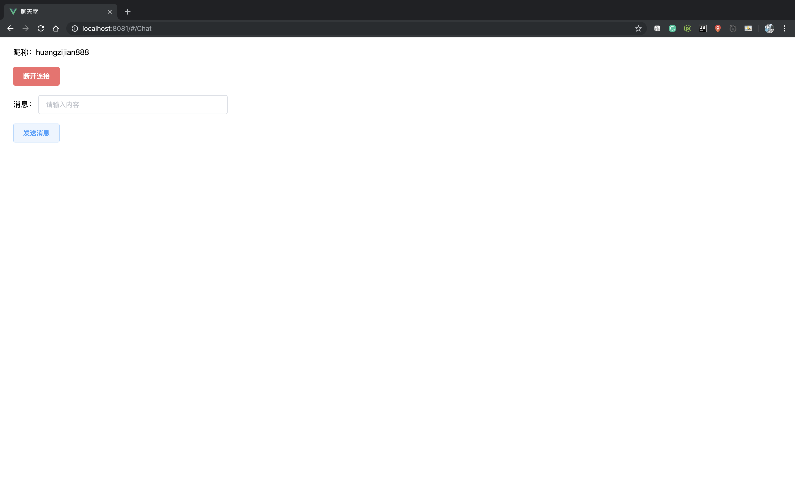

# 在线聊天室 ChatRoom
ChatRoom 是一个前后端分离的在线聊天室，项目采用 SpringBoot、Vue 开发。

>这个项目的前身为本人在学习 SpringBoot 集成 WebSoket 过程中写的一个 Demo 。本着用[工匠精神](https://baike.baidu.com/item/%E5%B7%A5%E5%8C%A0%E7%B2%BE%E7%A5%9E/3993110#1 "工匠精神")做开发的理念，遂有了本项目。

## 开发环境
1. macOS 10.14.6 
1. IntelliJ IDEA 2019.2.2
1. JDK 1.8

## 项目截图

输入昵称后按下回车键或点击连接按钮方可与服务器连接，进入聊天室。

若与服务器连接成功则显示以下页面

输入消息后按下回车键或点击发送消息按钮即可发送消息

##  技术栈
### 后端
1. SpringBoot
1. WebSocket
1. lombok

### 前端
1. Vue
1. Vue Router
1. ElementUI
1. stomp-js
1. sockjs-client

## 更新记录

### 2019.9.29 更新

本次更新版本：V1.0

本次更新完成了群聊功能

